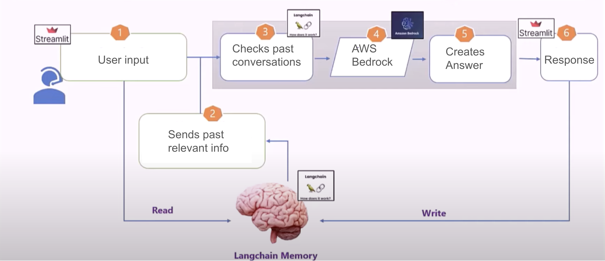

# Personal Chatbot with AWS Bedrock

## Visual

## Overview

This project implements a personal chatbot using AWS Bedrock, integrated with Streamlit for the front-end interface. The chatbot supports multi-modal inputs and outputs, including voice interaction, and incorporates features for image and media handling. Additionally, the chatbot includes analytics and insights capabilities to track user interactions and improve responses over time.

## Features

### Multi-modal Inputs and Outputs

The chatbot supports various input and output modes, including text, voice, and media content. Users can interact with the chatbot through different modalities, enhancing the user experience and accessibility.

### Voice Interaction

Integrated speech-to-text and text-to-speech functionalities enable users to interact with the chatbot through voice commands and responses. The chatbot can understand spoken input and respond with spoken audio, creating a more natural and intuitive interaction flow.

### Image and Media Handling

Users can upload images, videos, or other multimedia content as input to the chatbot. The chatbot utilizes image recognition and processing techniques to analyze and respond to media content effectively. For example, users can ask questions about objects in an image, and the chatbot can provide relevant information or responses.

### Analytics and Insights

The chatbot tracks user interactions to analyze user behavior and improve response accuracy. A feedback loop allows users to rate responses and provide comments for further refinement. Additionally, the chatbot generates insights and analytics reports to help developers understand usage patterns and identify areas for improvement.

## Technologies Used

### AWS Bedrock

AWS Bedrock is the core technology powering the chatbot's natural language processing capabilities. Bedrock leverages state-of-the-art language models and machine learning algorithms to understand and generate human-like responses.

### Streamlit

Streamlit is used to create the interactive front-end interface for the chatbot. Streamlit provides a user-friendly experience for interacting with the chatbot, allowing users to input text, voice, and media content seamlessly.

### Google Text-to-Speech (gTTS)

gTTS is utilized for text-to-speech conversion, enabling the chatbot to respond with spoken audio. gTTS provides high-quality, natural-sounding speech synthesis, enhancing the chatbot's voice interaction capabilities.

## Prompt Engineering and Training

### Prompt Engineering

Prompt engineering was a crucial part of developing this chatbot. We crafted specific prompts to guide the AI's responses effectively. By designing clear and contextually appropriate prompts, we ensured that the chatbot could handle various user inputs and provide meaningful responses. This involved iterating on prompt designs based on user feedback and performance testing.

### Training the Bot

The bot was trained using a combination of pre-existing datasets and custom data tailored to our specific use cases. We leveraged AWS Bedrock's capabilities to fine-tune the language model, optimizing it for our application. Training involved:

1. **Data Collection**: Aggregating diverse conversational datasets to cover a wide range of topics and contexts.
2. **Fine-tuning**: Using AWS Bedrock's tools, we fine-tuned the language model to improve its understanding and generation of responses based on our custom prompts.
3. **Evaluation and Iteration**: Continuously evaluating the chatbot's performance through user interactions and refining the model to enhance accuracy and relevance.

## How to Run

1. Clone the repository to your local machine.
2. Install the required dependencies.
3. Run the Streamlit app using `streamlit run chatbot_frontend.py`.
4. Interact with the chatbot through the provided interface.

